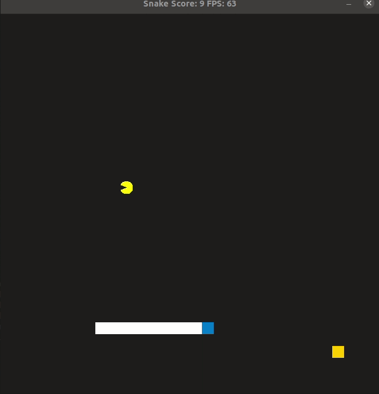

# Snake v Pacman

In this snake game Pacman is the antagonist. The goal is to eat the food that appears randomly and not get caught by Pacman.




## Dependencies for Running Locally
* cmake >= 3.7
  * All OSes: [click here for installation instructions](https://cmake.org/install/)
* make >= 4.1 (Linux, Mac), 3.81 (Windows)
  * Linux: make is installed by default on most Linux distros
  * Mac: [install Xcode command line tools to get make](https://developer.apple.com/xcode/features/)
  * Windows: [Click here for installation instructions](http://gnuwin32.sourceforge.net/packages/make.htm)
* SDL2 >= 2.0
  * All installation instructions can be found [here](https://wiki.libsdl.org/Installation)
  >Note that for Linux, an `apt` or `apt-get` installation is preferred to building from source. 
* SDL2_image >= 2.0
* gcc/g++ >= 5.4
  * Linux: gcc / g++ is installed by default on most Linux distros
  * Mac: same deal as make - [install Xcode command line tools](https://developer.apple.com/xcode/features/)
  * Windows: recommend using [MinGW](http://www.mingw.org/)

## Basic Build Instructions

1. Clone this repo.
2. Make a build directory in the top level directory: `mkdir build && cd build`
3. Compile: `cmake .. && make`
4. Run it: `./SnakeGame`.


## Project Structure

```
project
| .gitignore
| CMakeLists.txt
| LICENSE.md
| README.md
│
└─── assets
│   | pacman_and_ghost_texture.png
│   | snake_v_pacman.gif
│
└─── cmake
|   | FindSDL2_image.cmake
│
└─── src
    | actor.h
    | controller.cpp
    | controller.h
    | game.cpp
    | game.h
    | main.cpp
    | pacman.cpp
    | pacman.h
    | renderer.cpp
    | snake.cpp
    | snake.h

```

## Addressed rubic criteria

#### Readme  
* [x] Instructions
* [x] 3rd party libraries: SDL2, SDL2_image
* [x] Description

#### Compiling and Testing  
* [x] Compile & run without error

#### Loops, Functions, I/O  
* [x] Functions and control structures
* [x] Reads files, process data, outputs it
* [x] Accepts user input & output

#### Object Oriented Programming  
* [x] Organized in classes
* [x] Appropriate access for class members
* [x] Initialization lists
* [x] Clear interfaces
* [x] Encapsulate behaviour
* [x] Inheritance
* [ ] Overloaded functions
* [x] Override virtual functions
* [ ] Templates

#### Memory Management  
* [x] Pass-by-reference
* [x] Appropriate use of destructors
* [x] Uses RAII
* [ ] Follows the Rule of 5
* [ ] Uses move semantics instead of copying
* [ ] Smart pointers instead of raw pointers

#### Concurrency
* [ ] Uses multiple threads
* [ ] Uses promise & future
* [ ] Uses mutex or lock
* [ ] Uses condition variable
